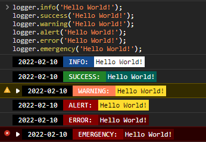
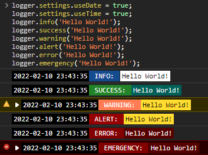
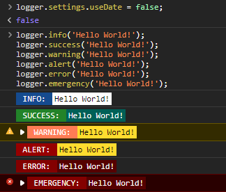

# OwOTools
A Repository for OwOBlog in JavaScript.
一个来自OwOBlog的神奇仓库.

<b>持续更新中... 请给一个Star表示支持我吧QWQ</b><br/>
<b>友情项目地址: </b>[OwOFrame](https://github.com/OwOBlogTeam/OwOFrame)

------


## Usage | 用法
#### 1. [Object:Logger]

```js
// 常规输出;
logger.info('Hello World~');
// 带彩色的输出 (可用于成功执行指定操作时输出此日志);
logger.success('Hello World!');
// 警告输出 (带默认的高亮);
logger.warning('Hello World!');
// 警告提示 (可以选择是否弹窗);
logger.alert('Hello World!', /* boom: boolean, default: false */);
// 错误提示, 使用常规Log格式输出;
logger.error('Hello World!');
// 紧急错误提示, 使用 Error等级格式输出 (与alert一样，可以选择是否弹窗);
logger.emergency('Hello World!' /* boom: boolean, default: false */);

// Settings 的默认配置如下:
const logger = {
  settings: {
    useDate: true,
    useTime: false,
  }
};
```
<br/>

效果如下 (默认配置):<br/>

<br/>

启用时间输出的效果如下:<br/>

<br/>

可以关闭默认的日期输出, 使用如下方法:
```js
logger.settings.useDate = false; // 关闭日期输出;
logger.settings.useTime = false; // 关闭时间输出;
```

效果如下:<br/>

<br/>
> 注意: 当 `logger.settings.useDate` 为 `false` 时, 将不会输出所有日期的格式.<br/>


#### 2. [Object:OwO]
一个通用方法合集. 目前开发进度如下:
[x] 模拟睡眠方法 (`owo.sleep(second: int|float)`)
[x] 高亮容器方法 (`owo.highlight(elementName: string, func: callable)`)


<hr/>
当前版本仅为30分钟开发版, 没有在多平台进行测试, 但目前可保证 `Microsoft Edge` 以及 `Google Chrome` 可以完美使用.<br/>


------


## Statement
&copy; 2016-2022 [`OwOBlog-DGMT`](https://www.owoblog.com). Please comply with the open source license of this project for modification, derivative or commercial use of this project.

> My Contacts:
- Website: [`HanskiJay`](https://www.owoblog.com)
- Telegram: [`HanskiJay`](https://t.me/HanskiJay)
- E-Mail: [`HanskiJay`](mailto:support@owoblog.com)