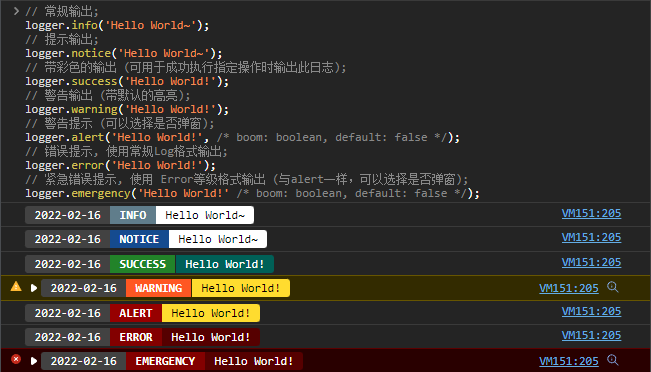
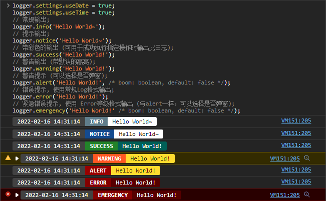
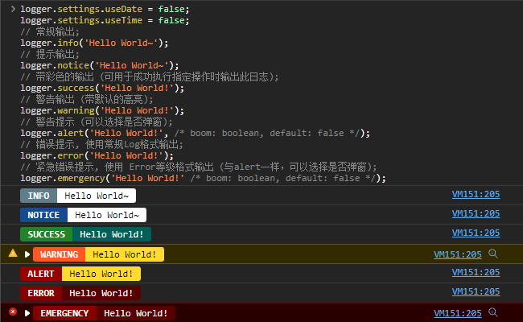
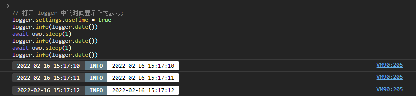
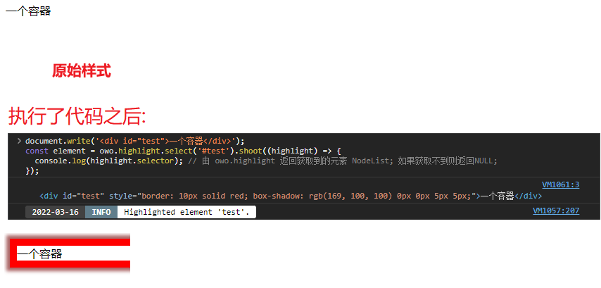
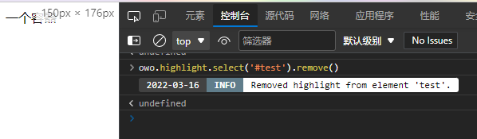

# OwOTools
Open source license :  [Learn More](https://opensource.org/licenses/Apache-2.0)

A Repository for OwOBlog in JavaScript.<br/>
一个来自OwOBlog的神奇仓库.<br/>
持续更新中... 请给一个Star表示支持我吧QWQ<br/>
<b>友情项目地址: </b>[OwOFrame](https://github.com/OwOBlogTeam/OwOFrame)


------


## Usage | 用法
### 1. [Object:Logger]

```js
// 常规输出;
logger.info('Hello World~');
// 提示输出;
logger.notice('Hello World~');
// 带彩色的输出 (可用于成功执行指定操作时输出此日志);
logger.success('Hello World!');
// 警告输出 (带默认的高亮);
logger.warning('Hello World!');
// 警告提示 (可以选择是否弹窗);
logger.alert('Hello World!', /* boom: boolean, default: false */);
// 错误提示, 使用常规Log格式输出;
logger.error('Hello World!');
// 紧急错误提示, 使用 Error等级格式输出 (与alert一样，可以选择是否弹窗);
logger.emergency('Hello World!' /* boom: boolean, default: false */);

// Settings 的默认配置如下:
const logger = {
  settings: {
    useDate: true,
    useTime: false,
  }
};
```

效果如下 (默认配置):<br/>

<br/>


启用时间输出的效果如下:<br/>
```js
logger.settings.useDate = true;
logger.settings.useTime = true;
```

<br/>


可以关闭默认的日期输出, 使用如下方法:
```js
logger.settings.useDate = false; // 关闭日期输出;
logger.settings.useTime = false; // 关闭时间输出;
```
效果如下:<br/>

<br/>


> <b>注意:</b> 当 `logger.settings.useDate` 为 `false` 时, 将不会输出所有日期的格式.<br/>


### 2. [Object:OwO]
一个通用方法合集. 目前开发进度如下:<br/>
- [x] 模拟睡眠方法 (`owo.sleep(second: int|float)`)
- [x] 高亮容器方法 (`owo.highlight.select(elementName: string, func: callable)`)

#### §2.1 `owo.sleep()`
此方法采用 `async/await` 模式通过在 `Promise` 下的异步操作模拟睡眠.<br/>
具体用法如下:
```js
// 打开 logger 中的时间显示作为参考;
logger.settings.useTime = true;
logger.info(logger.date());
await owo.sleep(1);
logger.info(logger.date());
await owo.sleep(1);
logger.info(logger.date());
```
运行截图:<br/>

<br/><br/>

#### §2.2 `owo.highlight.select()`
一个方便快速找到指定元素的函数. 目前实现的功能比较粗糙简陋, 仅仅使用了 `border` 来修改元素的边框. 预计的工作列表如下:
- [x] 高亮部分显示
- [x] 控制台输出
- [x] 移除高亮部分的函数
- [ ] 鼠标悬浮时显示一些元素的细节 (例如`高度`, `宽度`, 元素`className`/`id`)


范例代码如下:
```js
document.write('<div id="test">一个容器</div>');
const element = owo.highlight.select('#test').shoot((highlight) => {
  console.log(highlight.selector); // 由 owo.highlight 返回获取到的元素; 如果获取不到则返回NULL;
});
```
效果如下:<br/>


同样可以使用 `remove()` 方法移除高亮部分.
```js
owo.highlight.select('#test').remove();
```
效果如下:<br/>



------


## Statement
&copy; 2016-2022 [`OwOBlog-DGMT`](https://www.owoblog.com). Please comply with the open source license of this project for modification, derivative or commercial use of this project.

> My Contacts:
- Website: [`HanskiJay`](https://www.owoblog.com)
- Telegram: [`HanskiJay`](https://t.me/HanskiJay)
- E-Mail: [`HanskiJay`](mailto:support@owoblog.com)